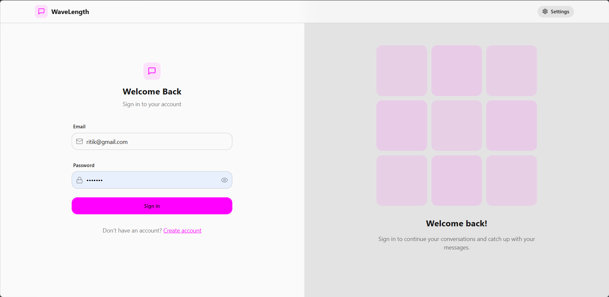
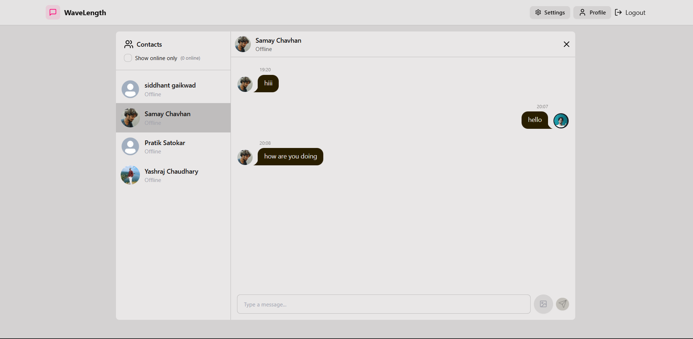
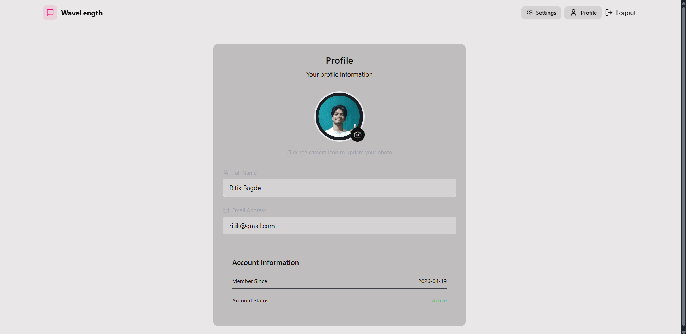

# 🌊 Wavelength — Full Stack Chat App

Wavelength is a real-time full-stack chat application built with modern web technologies. It supports authentication, live messaging, online status tracking, and profile customization.

---

## 🚀 Features

* 🔐 User Authentication (JWT + Cookies)
* 💬 Real-time Messaging (Socket.io)
* 🟢 Online/Offline Status
* 🖼️ Profile Image Upload (Cloudinary)
* ⚡ Fast UI with React + Zustand
* 🌐 REST API with Express & MongoDB

---

## 🛠️ Tech Stack

### Frontend

* React (Vite)
* Zustand (State Management)
* Tailwind CSS
* Axios

### Backend

* Node.js
* Express.js
* MongoDB (Mongoose)
* Socket.io
* Cloudinary (Image Upload)

---

## 📁 Project Structure

```
chatty/
│
├── Backend/
│   ├── controllers/
│   ├── models/
│   ├── routes/
│   ├── middleware/
│   └── lib/
│
├── Frontend/
│   ├── src/
│   └── components/
│
└── package.json
```

---

## ⚙️ Environment Variables

Create a `.env` file in the backend:

```
MONGO_URI=your_mongodb_uri
JWT_SECRET=your_secret
CLOUDINARY_CLOUD_NAME=your_name
CLOUDINARY_API_KEY=your_key
CLOUDINARY_API_SECRET=your_secret
```

---

## 🚀 Run Locally

### 1. Clone the repo

```
git clone https://github.com/your-username/wavelength.git
cd wavelength
```

### 2. Install dependencies

```
cd Backend
npm install

cd ../Frontend
npm install
```

### 3. Start backend

```
cd Backend
npm run dev
```

### 4. Start frontend

```
cd Frontend
npm run dev
```

---

## 📸 Screenshots

<p align="center">
  
  
  
</p>
---

## 🔮 Future Improvements

* Typing indicators
* Message read receipts
* File sharing
* Group chats

---

## 🤝 Contributing

Feel free to fork this repo and improve it!

---

## ⭐ Show some love

If you like this project, give it a star ⭐
